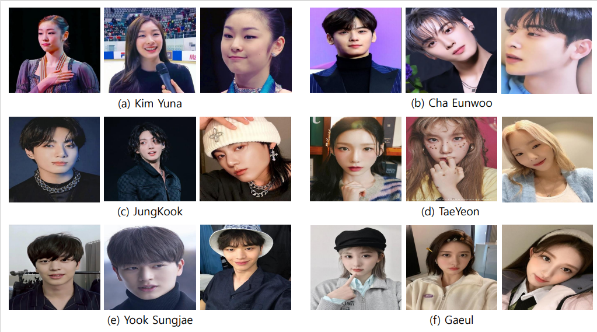

## KoIn_Benchmark_Dataset - Korean Influencer

### New Benchmarks for Asian Facial Recognition Tasks: Face Classification with Large Foundation Models
* This repository provides Korean Influencer(KoIN) Dataset and PyTorch implementations for Image Classification models.
* This work is presented at arXiv

### Authors
[Jinwoo Seo](https://github.com/dukong1), [Soora Choi](https://github.com/SooraChoi), [Eungyeom Ha](https://github.com/poori-nuna), [BeomJune Kim](https://github.com/Kdavid2355), [Dongbin Na](https://github.com/ndb796)

### Abstract
> The face classification system is an important tool for recognizing personal identity properly.
This paper introduces a new Large-Scale Korean Influencer Dataset named KoIn.
Our presented dataset contains many real-world photos of Korean celebrities in various environments that might contain stage lighting, backup dancers, and background objects.
These various images can be useful for training classification models classifying K-influencers.
Most of the images in our proposed dataset have been collected from social network services (SNS) such as Instagram.
Our dataset, KoIn, contains over 100,000 K-influencer photos from over 100 Korean celebrity classes.
Moreover, our dataset provides additional \textit{hard case} samples such as images including human faces with masks and hats.
We note that the hard case samples are instrumental in evaluating the robustness of the classification systems.
We have extensively conducted several experiments utilizing various classification models to validate the effectiveness of our proposed dataset.
Specifically, we demonstrate that recent state-of-the-art (SOTA) foundation architectures show decent classification performance when trained on our proposed dataset.
In this paper, we also analyze the robustness performance against hard case samples of large-scale foundation models when we fine-tune the foundation models on the normal cases of the proposed dataset, KoIn.
Our presented dataset and codes will be publicly available for academic purposes after the paper is accepted.

### Datasets
* The dataset is divided into three distinct groups based on the difficulty of Korean influencer / Asian image classification, the <b>Normal cases</b>, the <b>Hard cases</b>, and the <b>Group cases</b>.

    

* This repository provides (1) Normal case training dataset, (2) Normal case test dataset, (3) Hard case test dataset, (4) Group case test dataset

    <pre><b>Dataset/</b>
        <b>normal_cases/</b>
            train/
                0000/
                    0.jpg
                    .....
                0001/
                ....
                0099/
            test/
        <b>hard_cases/</b>
            test/
        <b>Group_cases/</b>
            test/</pre>

* The normal case training dataset contains 100,000 images.
* The normal case test dataset contains 5,000 images.
* The hard case test dataset contains 1,000 images.
* The group case test dataset contains 500 images.
  
### Source Codes

### Source Codes

* Datasets and source codes that match the experimental environment.
  
    |          | Dataset |
    |----------|---------|
    | KoIn10 |
[KoIn10](https://drive.google.com/drive/folders/178c7uJM99eY87OZJQAy_Vn6u5xgAezwc?usp=sharing)
|
    | KoIn50 |
[KoIn50](https://drive.google.com/drive/folders/14V2QCmqjrMXgasbnuZ0NpnLzWU2621fC?usp=sharing)
|
    | KoIn100 |
[KoIn100](https://drive.google.com/drive/folders/10t3fAwlNV764pzHz1crinezgDfEsU1i5?usp=sharing)
|

    |              | Architecture |
    |--------------|--------------|
    |    ResNet    |
 [ResNet_foundation_model]()
    |   DenseNet   |
 [DenseNet_foundation_model]()
    | EfficientNet |
 [EfficientNet_foundation_model]()
    |    BiT-M     |
 [BiT-m_foundation_model]()
    |    CLIP      |
 [CLIP_foundation_model]()
### Demonstration
* The example images from the hard case test dataset and the corresponding inference results based on the training dataset.

  

* The detection performance of trained models.

  
  
### Citation
